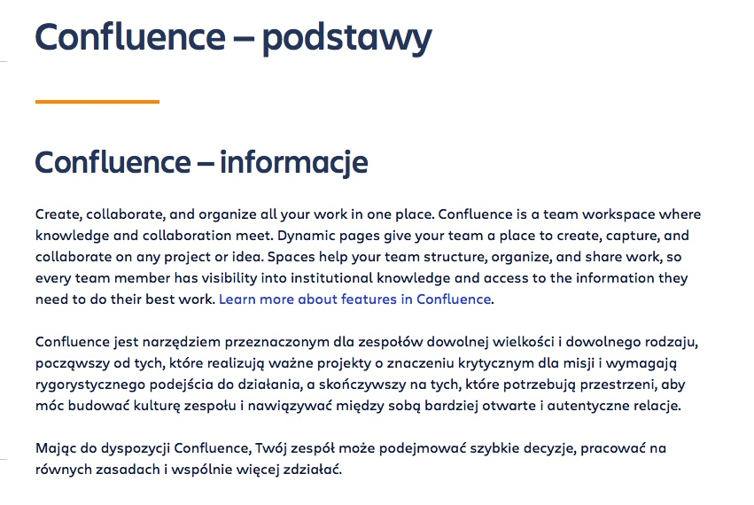

# **Techwriter Wannabe Reads Documentation : Jira, Confluence and MadFlare Cap Overview**

   [Jira & Confluence](#jira--confluence)  
   1. [Easily accessible](#easily-accessible)
   2. [Simple help panel](#simple-help-panel)
   3. [Available in other languages](#available-in-other-languages)
   4. [Overall impressions](#overall-impressions)  
   
   [MadCap Flare](#madcap-flare)  
   1. [A little harder to find](#a-little-harder-to-find)
   2. [Detailed online help](#detailed-online-help)
   3. [No translation](#no-translation)
   4. [Conclusions](#conclusions)

📚 What keeps an aspiring technical writer awake at night? For me, it is definitely the overwhelming number of new tools to learn. After years of simply typing into a text editor, I woke up in a world filled with terms such as authoring solutions, single-sourcing and content reuse. In times like these, reading technical documentation can be a life saver: not only does it help to grasp the concept of these tools, but it also allows to compare the **pros and cons** of their online help. So, let’s take a closer look at the documentation of three popular solutions: **Jira**, **Confluence** and **MadCap Flare**.

## Jira & Confluence
 
📚 As both of these tools come from the Atlassian family and the organization of their documentation is very similar, I decided to analyze them together in order highlight their similarities and differences. 

1. ### **Easily accessible** 

    When logging to [Confluence](https://techcommvistula.atlassian.net/wiki/spaces/TECHCOMMVI/overview) for the first time, we can see a **Quickstart** menu on the right:  

      

    It does not give much information, but it is useful as an introduction.  

    **Jira** has this feature as well. It also suggests a few articles that you can read directly in the **Help** panel and then evaluate their usefulness:  

    

    I think a more detailed **Quickstart** menu would be a good idea in both cases, just to give us a general overview of the most important functions  
 
2. ### **Simple help panel**  

    In order to find detailed documentation for both tools, we need to click on the **question mark** button at the top right-hand corner: its visibility and accessibility is a big plus.  
    From here, we can go to (both in **Jira** and **Confluence**):  
    * [Read help articles](https://support.atlassian.com/confluence-cloud/resources/): this section is divided into a series of articles with mini-presentations embedded in the text. What I liked the most about them is that they are written in a simple, fun language and provide understandable, step-by-step instructions.  
    * [Ask the community](https://community.atlassian.com/t5/Confluence/ct-p/confluence): another self-help feature, providing answers to specific questions asked by users.  
    * [What's new](https://confluence.atlassian.com/cloud/blog): a section containing changes and updates to the tools.  

    But what I found **the most interesting** in this documentation is somewhat hidden: 
    * [Atlassian University](https://university.atlassian.com/student/catalog) courses.  
    Nowhere to be seen in the **Confluence** **Help** menu, this feature can only be found in Jira's under the **Learn Jira** button:  
      

    Such courses also exist for Confluence, so it would be great to add a **Learn Confluence** button as well.  

    This feature gives you access to both **free and paid courses**. They are self-paced and they look a little bit like a game: you can earn badges and complete levels. I found the *Fundamentals* free course particularly useful, as it explains the very basics of both tools:  

      

    Another great thing about these courses is their **interactivity**: you can practice in the tool itself while you’re learning:

      

    and then take an **assessment test** to evaluate yourself.  

3. ### **Available in other languages**  

 **Jira** and **Confluence** have some of their documentation translated into other languages, although, again, it is not the easiest to find (I accessed the [Polish website](https://www.atlassian.com/pl/software/confluence) through Google).  

 Another problem is the translation itself, which is **not always complete** in Polish. Below are examples of the same content in Polish and French (in **Confluence**):  

 
   

 and in Polish and Spanish (in **Jira**):  

   
   

 Additionally, the **introductory videos are not translated** into any language (other than English), which is not consistent with written materials.  
4. ### **Overall impressions**
   
 📚 Both in **Jira** and **Confluence**, the technical documentation is unified, diverse, interactive and detailed. However, it would help to work a bit more on the translated content. Also, because it is so vast and similar for both tools, the documentation is somewhat scattered around the Atlassian website: it takes some time to track down the interesting content.  

  

## MadCap Flare  

1. ### **A little harder to find**  

Compared with **Jira** and **Confluence**, **MadCap Flare** makes it a little more difficult to access documentation. Instead of a visible question mark button, there is a ribbon with many options to choose from:  

  

The specific documentation for this particular piece of software can be found under Support/Online Help and Documentation/[MadCap Flare](https://help.madcapsoftware.com/flare2021r2/Content/Flare/Introduction/Home.htm).  

At first, we are greeted by the **chatbot Simon**, wich we cannot actually chat with. Luckily, it gives us a few options to point us in the right direction:  
  

Personally, I am not a fan of chatbots, but this one is not that annoying and it actually gives useful basic information 😉 

  
  

2. ### **Detailed online help**  

The good news is, once we find the button that we are looking for, we enter a **comprehensive, clearly organized guide** with everything that we might possibly need. Among other things, **MadCap Flare** provides us with:
* [Key concepts and features](https://help.madcapsoftware.com/flare2021r2/Content/Flare/Introduction/Features/Key-Features.htm): to get us started.   
* Step-by-step [tutorials](https://help.madcapsoftware.com/flare2021r2/Content/Flare/Tutorials/Tutorials.htm): very intuitive and containing relevant screenshots that can be enlarged.  
* [Resources](https://help.madcapsoftware.com/flare2021r2/Content/Flare/Introduction/Resources.htm) containing **PDFs** and **videos** narrated by humans (unlike in the previously analyzed tools), which makes them easier to follow. It might have been a good idea to add subtitles to them (only the automated ones are available).  
And as can be seen in the [Product Demo](https://www.madcapsoftware.com/videos/flare/product-demo-an-overview-of-madcap-flare/#content) video, the program itself contains a new project wizard, perfect for inexperienced users.  
* [Troubleshooting](https://help.madcapsoftware.com/flare2021r2/Content/Flare/Troubleshooting/Troubleshooting.htm): another useful tab, missing from **Jira** and **Confluence**, which makes it possible to find solutions on our own.  

Moreover, under the **Customers** tab on the [main page](https://www.madcapsoftware.com), we can also find [Customer Showcase](https://www.madcapsoftware.com/customers/customer-showcase/), where we can look at examples of real documentation made with **MadCap Flare**.  

3. ### **No translation**  

Unfortunately, I could not find any online help resources for **MadCap Flare** in languages other than English.  

4. ### **Conclusions**  

📚 Compared to **Jira** and **Confluence**, **MadCap Flare**’s technical documentation seems more advanced and better organized. It might be due to the fact that, from what I have learned so far, **MadCap Flare** is a tool developed specifically for technical writers.😄 The main change I would consider would be adding resources in other languages: it would certainly help techwriters who do not work with English.  

